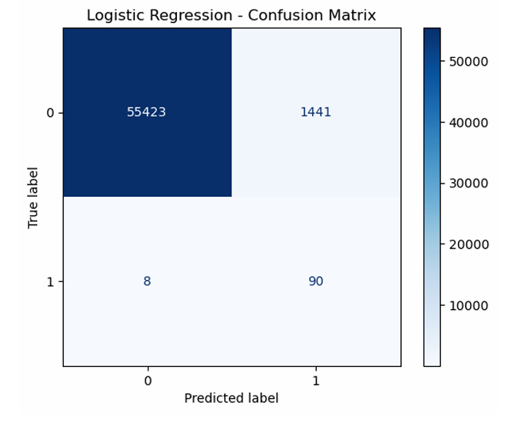
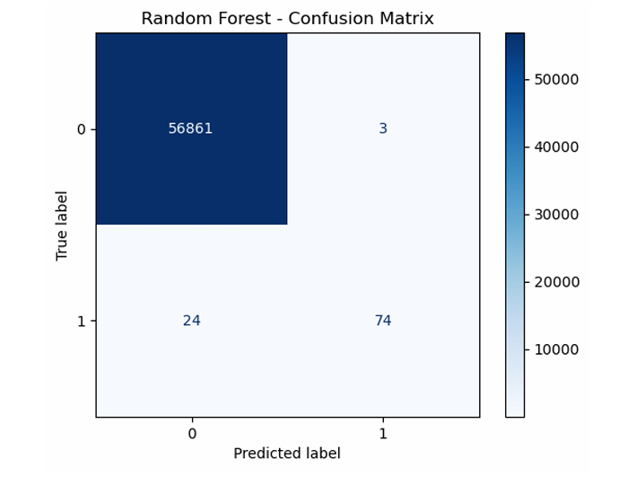
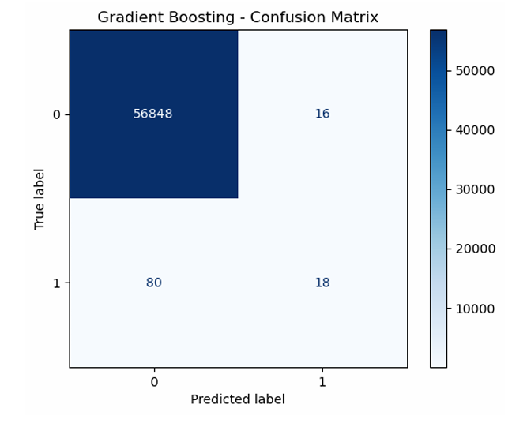
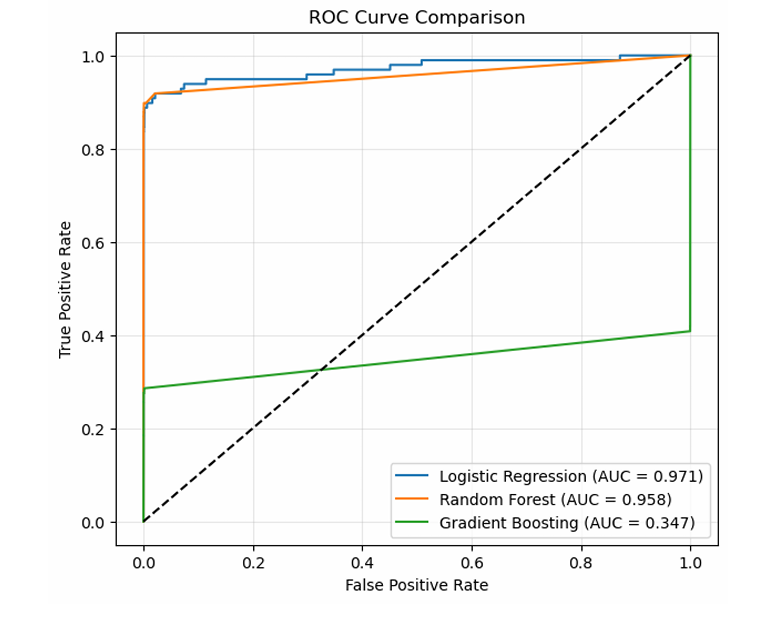

# 💳 Credit Card Fraud Detection

## 🔍 Overview
Credit card fraud detection is a critical real-world problem where the goal is to identify
fraudulent transactions among millions of legitimate ones. One of the main challenges in
this domain is the highly imbalanced nature of the data, where fraudulent transactions
represent a very small fraction of total transactions.

In this project, we build an end-to-end machine learning pipeline to detect fraudulent
credit card transactions using three different models:
  - Logistic Regression
  - Random Forest
  - Gradient Boosting Classifier

Special emphasis is placed on handling class imbalance and evaluating models using
appropriate metrics such as Recall, Precision, and F1-score rather than accuracy alone.

## 📊 Dataset
Source: Kaggle Credit Card Fraud Detection Dataset  
Total transactions: 284,807  
Fraud cases: 492 (0.17%)

Dataset not included due to licensing restrictions.  
Most features are anonymized using PCA to protect user privacy.

## 🛠️ Methodology
- Exploratory Data Analysis (EDA)
- Feature scaling
- Stratified train-test split
- Class imbalance handling
- Model training and evaluation

## 📈 Evaluation Metrics
- Confusion Matrix
- Precision, Recall, F1-score
- ROC-AUC Score

## 🏆 Results
1. Logistic Regression achieved the highest ROC-AUC score.  
2. Random Forest performed competitively.  
3. Gradient Boosting underperformed without hyperparameter tuning.

## 🖼️ Visual Results

### 🔹 Confusion Matrix – Logistic Regression


### 🔹 Confusion Matrix – Random Forest


### 🔹 Confusion Matrix – Gradient Boosting


### 🔹 ROC Curve Comparison


## 📋 Model Performance Summary

| Model               | Recall (Fraud) | Precision (Fraud) | ROC-AUC |
|--------------------|---------------|-------------------|---------|
| Logistic Regression | High          | Low–Moderate      | Highest |
| Random Forest       | Moderate–High | High              | High    |
| Gradient Boosting   | Low           | Moderate          | Low     |

## 🧠 Conclusion
This project demonstrated an end-to-end machine learning approach for detecting
fraudulent credit card transactions on a highly imbalanced dataset.

Logistic Regression proved to be the most reliable model in terms of overall class
separation, achieving the highest ROC-AUC score due to effective class weighting.
Random Forest captured non-linear patterns and performed competitively, while
Gradient Boosting underperformed without extensive hyperparameter tuning.

The results highlight that simpler, well-regularized models can outperform more
complex models in highly imbalanced real-world problems.

## 🙏 Acknowledgements
Dataset provided by Kaggle.  
This project was developed for academic and portfolio purposes.

## 📂 Project Structure
```text
credit-card-fraud-detection/
├── notebooks/
├── src/
├── results/
├── data/
├── README.md
├── requirements.txt
└── .gitignore
